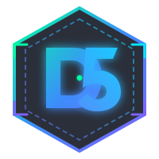

# 🥷 Deepfake Ninja: Real-Time AI Biometric Defense Game

<div align="center">



### **Interactive Biometric Cybersecurity Arcade Game powered by On-Device AI Vision**
**Created by [DilshaM5](https://github.com/DilshaM5)**

[](https://www.typescriptlang.org/)
[](https://vitejs.dev/)
[](https://developers.google.com/mediapipe)
[](https://webassembly.org/)
[](https://www.docker.com/)
[](LICENSE)

</div>

---

## 🎯 Overview

**Deepfake Ninja** is a high-performance web arcade game inspired by *Fruit Ninja*, built to gamify **biometric identity verification, anti-spoofing, and liveness detection**.

Players use their **real hands** via webcam to slice through incoming cyber threats (deepfakes, 3D silicone masks, virtual camera emulators) while protecting genuine biometric identity documents.

---

## ✨ Key Features

- 🖐️ **Real-Time On-Device Hand Tracking**:
  - Powered by **Google MediaPipe Vision** compiled to WebAssembly (WASM).
  - Tracks up to 2 hands simultaneously with zero cloud latency.
  - Automatic **GPU (WebGL) with graceful CPU fallback** for maximum cross-device compatibility.
  - Spatial consistency filter (`Nearest-Neighbor Tracking`) and teleport jump suppression to prevent trail swapping.

- ⚔️ **Dual Laser Blade Mechanics**:
  - High-fps glowing neon laser blades mapped to fingertip coordinates.
  - Smooth particle trails, slash speed calculation, and impact shockwaves on the 2D HTML5 Canvas.

- ✋ **Dual Open-Palm Gesture Start / Restart**:
  - Raise both open palms (high-five gesture) to charge and start the game or restart after Game Over without touching the keyboard.
  - Full keyboard (`Spacebar`) and mouse/touchscreen fallback modes.

- 🛡️ **Biometric Liveness Gameplay Matrix**:
  - **SLASH THREATS** (`+Score`):
    - 🎭 **3D Silicone Mask Attack** (`+100`)
    - 🤖 **AI Synthetic Deepfake** (`+150`)
    - 📹 **Virtual Camera Injection / Emulator** (`+120`)
  - **PROTECT CITIZENS** (`Do NOT slice`):
    - 🪪 **National ID Card**
    - 📄 **Residence Permit (VNJ)**
    - 🤳 **Live Biometric Selfie**
    - *Accidental slice = False Rejection penalty (-1 Shield)*.
  - ⚡ **Bonus Overdrive**:
    - Catch the rare Cyber Shield emblem for `+1 Shield` and temporary Overdrive combo boost.

- 🌐 **Full Trilingual Localization**:
  - Instant on-the-fly switching between **Қазақша (Kazakh)**, **Русский (Russian)**, and **English** without page reload.
  - Automatic browser locale detection.

- 📊 **Session Leaderboard & Verification Analytics**:
  - Live session tracking of high scores, accuracy %, and defense rating tiers (S, A, B, C).

- 🔒 **Privacy by Design**:
  - 100% client-side execution in the browser.
  - No camera stream or biometric video frames are ever recorded or transmitted over the network.
  - All demonstration identity documents feature anonymized 3D avatars and redacted PII fields.

---

## 🛠️ Architecture & Tech Stack

```
deepfake-ninja/
├── public/                 # Static assets, models, wasm binaries
│   ├── assets/             # Anonymized sample biometric documents & attack textures
│   ├── models/             # MediaPipe HandLandmarker task model (~7.8MB)
│   ├── wasm/               # Vision WebAssembly modules (SIMD & non-SIMD)
│   └── logo.svg            # DilshaM5 Cyber Emblem vector logo
├── src/
│   ├── assets/             # Procedural asset loader & fallback textures
│   ├── engine/             # Core engines
│   │   ├── camera.ts       # Resilient webcam stream manager
│   │   ├── handTracker.ts  # MediaPipe HandLandmarker with GPU/CPU fallback
│   │   ├── blade.ts        # Laser blade trail physics & particle renderer
│   │   ├── sliceEngine.ts  # Line-segment geometric collision detection
│   │   ├── spawner.ts      # Biometric entity trajectory & physics spawner
│   │   ├── particles.ts    # Spark, slash, and floating combat text engine
│   │   └── audio.ts        # Web Audio API procedural sound engine
│   ├── game/               # Game state & scoring
│   │   ├── gameState.ts    # Finite State Machine (Menu, Playing, GameOver)
│   │   ├── settings.ts     # Reactive settings with LocalStorage persistence
│   │   ├── leaderboard.ts  # Session high scores leaderboard
│   │   └── entities/       # Slicable biometric target items
│   ├── i18n/               # Multilingual translations (KZ, RU, EN)
│   ├── ui/                 # Cyberpunk HUD, settings modal & verification report
│   ├── main.ts             # Main game loop orchestration
│   └── style.css           # Custom cyberpunk glassmorphism design system
├── Dockerfile              # Multi-stage production Nginx container
├── docker-compose.yml      # Orchestration with Cloudflare tunnel support
├── nginx.conf              # Optimized Nginx config with WASM MIME & CORS headers
└── vite.config.ts          # Vite build configuration with relative base paths
```

---

## 🚀 Quick Start

### Prerequisites
- [Node.js](https://nodejs.org/) (v18 or higher)
- A modern browser with webcam support (Chrome, Edge, Firefox, Safari)

### Local Development

1. **Clone the repository**:
   ```bash
   git clone https://github.com/DilshaM5/deepfake-ninja.git
   cd deepfake-ninja
   ```

2. **Install dependencies**:
   ```bash
   npm install
   ```

3. **Start the development server**:
   ```bash
   npm run dev
   ```

4. Open your browser at `http://localhost:5173` and allow camera permissions.

---

### Docker Deployment

To run a production-ready container with Nginx:

```bash
docker compose up -d --build
```

Access the application at `http://localhost:8080`.

---

## 🌐 Deploy to GitHub Pages

The project is pre-configured with relative base paths (`base: './'`). You can deploy it for free to **GitHub Pages**:

1. Push this repository to your GitHub account (`DilshaM5/deepfake-ninja`).
2. Go to **Settings** $\rightarrow$ **Pages**.
3. Under **Build and deployment**, select **GitHub Actions** (or deploy directly from `gh-pages` branch after running `npm run build`).
4. Your live game will be instantly playable worldwide over HTTPS at:
   ```
   https://dilsham5.github.io/deepfake-ninja/
   ```

---

## 📜 License

This project is open source and available under the [MIT License](LICENSE).

**Developed with 💙 and cyber-precision by [DilshaM5](https://github.com/DilshaM5)**.
